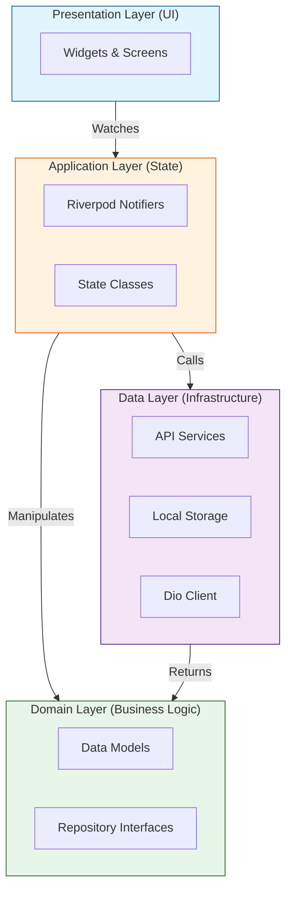
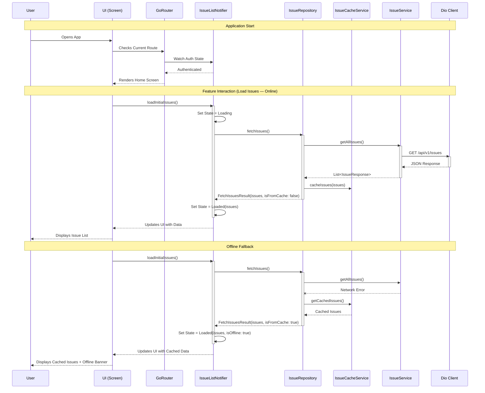

# Mudda Frontend

Mudda Frontend is a Flutter application that serves as the user interface for the Mudda platform. It provides a modern, responsive, and interactive experience for browsing, viewing, and engaging with posts and discussions.

## Features

- Infinite scrolling feed of posts with images, likes, and comments
- Detailed post view with comments and actions
- Category filtering
- Pull-to-refresh support
- **Offline Support**: Issues are cached locally so users can view them without an internet connection. An offline banner is shown when viewing cached data.
- Bottom navigation bar for quick access to main sections
- Responsive UI for Android devices
- Drawer menu for profile, settings, and support

## Architecture Overview

This project follows a **Feature-First, Layered Architecture** powered by **Riverpod** for state management and **GoRouter** for navigation. The goal is to separate concerns, making the codebase scalable, testable, and easy to maintain.

### High-Level Architecture

The application is divided into four main layers:



### Data Flow & Interaction

The following sequence diagram illustrates how data flows through the application when a user interacts with a feature (e.g., viewing the issue feed).



### Key Components

-   **Presentation Layer (`lib/features/*/presentation`)**:
    -   Contains generic Widgets and Screens.
    -   **Passive View**: UI components listen to state changes from Riverpod providers and rebuild accordingly.

-   **Application Layer (`lib/features/*/application`)**:
    -   **Notifiers**: `StateNotifier` or `AsyncNotifier` subclasses (e.g., `AuthNotifier`, `IssueListNotifier`).
    -   Manage the state of the application and handle user logic.
    -   Interact with Repositories to fetch or update data.

-   **Domain Layer (`lib/api/models`)**:
    -   Defines the core business objects (e.g., `Issue`, `User`, `Comment`).
    -   Pure Dart classes, often generated with `freezed` or `json_serializable`.

-   **Data Layer (`lib/api/services`, `lib/api/repositories`)**:
    -   **Services**: Handle direct API calls using `Dio`. They map JSON to Dart objects.
    -   **IssueCacheService**: Caches issues locally via `SharedPreferences` for offline support.
    -   **Repositories**: Abstract the data source. They provide a clean API for the application layer, handling data transformations, caching, and error mapping.
    -   **DioProvider**: A centralized HTTP client configured with interceptors (like `AuthInterceptor` for injecting tokens).

### Project Structure

```
lib/
├── api/                # API layer (services, repositories, models)
│   ├── models/         # Data models
│   ├── services/       # API service classes
│   └── repositories/   # Repository implementations
├── core/               # Shared infrastructure
│   ├── di/             # Dependency injection (Riverpod providers)
│   ├── navigation/     # GoRouter configuration
├── features/           # Feature modules
│   ├── auth/           # Authentication feature
│   ├── issues/         # Issues (posts) feature
│   ├── voting/         # Voting feature
│   ├── comments/       # Comments feature
│   ├── profile/        # Profile feature
│   ├── dashboard/      # Dashboard feature
│   ├── activity/       # Activity feed feature
│   └── about/          # About Us feature
├── shared/             # Shared UI components and logic
│   └── theme/          # App theme configuration
└── main.dart           # Application entry point
```

### State Management

- **Riverpod**: Modern, compile-safe state management
- **Notifiers**: Each feature has dedicated notifiers (e.g., `IssueListNotifier`, `AuthNotifier`)
- **Optimistic Updates**: Voting uses optimistic UI updates for better UX

### Navigation

- **GoRouter**: Declarative routing with authentication guards
- **ShellRoute**: Bottom navigation with persistent shell

### Testing

Run all tests:
```bash
flutter test
```

Run specific test:
```bash
flutter test test/widget/features/issues/issue_card_test.dart
```


## Getting Started

### Prerequisites

- [Flutter SDK](https://docs.flutter.dev/get-started/install) (latest stable)
- Android Studio or Visual Studio Code
- A physical or virtual Android device

### Installation & Setup

1. **Download Flutter**  
   - Preferably use the VS Code extension for Flutter.  
   - After downloading, create a new Flutter project or wait for the notification pop-up to appear.  
   - If prompted, download the Flutter SDK and install it.

2. **Download Android Studio**  
   - After installation, it will prompt you to download the Android SDK.  
   - **Important:** Install the SDK in a path that contains **no spaces** (to avoid issues with NDK and Flutter).

3. **Configure Android Studio SDK Tools**  
   - Go to `Settings` → `Languages & Frameworks` → `Android SDK`.
   - Switch to the **SDK Tools** tab and check the boxes for:
     - Command-line tools
     - Google USB Driver
     - NDK

4. **Create an Android Virtual Device (AVD)**  
   - Return to the main screen → More Options → Virtual Device Manager / AVD Manager.
   - Follow the prompts to create and launch a virtual Pixel device.

5. **Set Environment Variables**  
   - Go to your system's environment variables.
   - Create a variable named `ANDROID_HOME` with the value set to your SDK path.
   - Add the following to your `PATH`:
     - The Android SDK folder path
     - `<SDK_PATH>/platform-tools`
     - The Flutter SDK `bin` folder path

6. **(Alternative) Manual Flutter SDK Setup**  
   - Download the Flutter SDK and extract it to your chosen directory.
   - Copy the absolute path to the `bin` folder and add it to your `PATH` environment variable.
   - **Ensure the path does not contain spaces.**

7. **Permissions & Troubleshooting**  
   - If you encounter Gradle errors about file permissions, ensure your user has full access to:
     - The Flutter SDK folder
     - The Android SDK folder
     - Your project files
   - Avoid having Google Drive, Jio AI Cloud, or your IDE lock these files, as this can cause build failures.

### Running the App

1. **On a Physical Device**
   - On your phone, enable Developer Options and turn on USB debugging and "Install via USB".
   - Connect your phone to your computer via USB.
   - In your IDE, select your device (in VS Code, from the bottom bar on the right).
   - Use the Run/Debug button in VS Code to launch the app.

2. **On an Emulator**
   - In Android Studio, launch the virtual device from the right-side menu.
   - Select the device from the drop-down above the editor window and press Run.

3. **From the Command Line**
   ```sh
   flutter run
   ```
4. **Quick check**
   - Go to dartpad.dev and paste the code. Ask in the chatbar below to make it runnable and add a main function.
   - Click run. There might be problem with the size so make the preview window thinner like a mobile.
   - ???
   - Profit

- Use `Ctrl+S` for hot reload during development.

## Getting Help

For help getting started with Flutter development, view the
[online documentation](https://docs.flutter.dev/), which offers tutorials,
samples, guidance on mobile development, and a full API reference.

## Contributing

Contributions are welcome! Please read the [CONTRIBUTING.md](CONTRIBUTING.md) file for details on how to contribute to this project.

## License

This project is licensed under the MIT License - see the [LICENSE](LICENSE) file for details.
